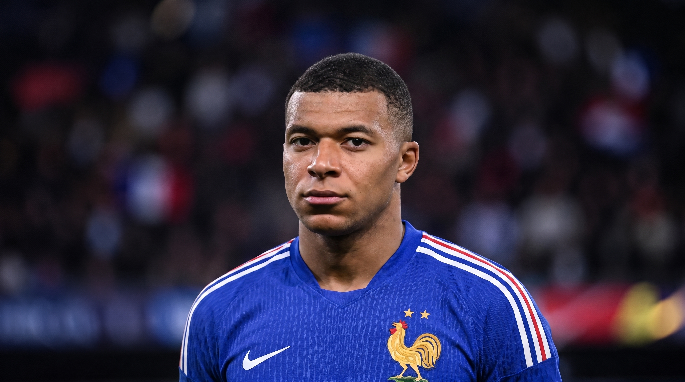
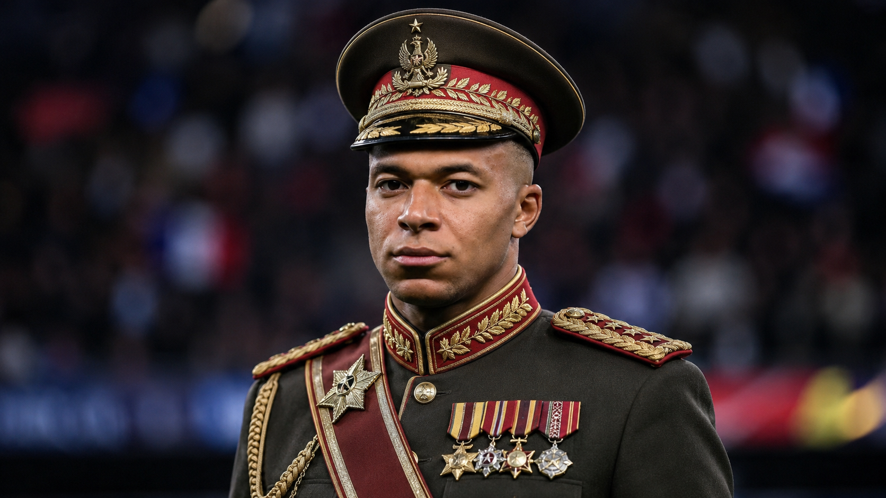

<h1 align="center">👑 MBAPPÉ — The Hidden Emperor</h1>

<p align="center">
  <b>Move your mouse over the striker… and reveal the general underneath.</b><br>
  A one-page web experiment with a cursor-driven <i>spotlight reveal</i> effect and a slick EN / FR / PT language switcher.
</p>

<p align="center">
  
  
  
  
  
</p>

---

## ✨ The trick

Two photos of the same man. One is the **striker** (Les Bleus, No. 10). The other is the **emperor** — same pose, same framing. A spotlight follows your cursor and **paints away** the first image to reveal the second, only where you point.

<table>
  <tr>
    <td align="center"><b>🟦 Base — what everyone sees</b></td>
    <td align="center"><b>🟨 Revealed — under the spotlight</b></td>
  </tr>
  <tr>
    <td></td>
    <td></td>
  </tr>
</table>

> 🖱️ **The magic only happens on desktop** — the effect follows a real mouse. On touch screens you just see the base image (by design).

---

## 🎯 Features

- 🔦 **Cursor spotlight reveal** — a radial mask that eases smoothly toward the mouse
- 🧊 **Pure `<canvas>` + CSS mask** — no animation libraries, no WebGL, ~150 KB JS
- 🌍 **3 languages** — 🇬🇧 English · 🇫🇷 Français · 🇧🇷 Português, with a glass dropdown switcher
- 💾 **Remembers your language** (localStorage) and updates `<html lang>`
- 🕸️ **Reactive grid** that parallax-shifts with the cursor
- 🖤 **Dark + gold** cinematic UI, fully responsive

---

## 🌍 Language switcher

A frosted-glass dropdown in the top corner: globe icon → flag → language code. The active language glows **gold**. Defaults to English, switches instantly, and your choice sticks between visits.

---

## 🛠️ Tech stack

| | |
|---|---|
| **Framework** | React 18 + TypeScript |
| **Build** | Vite 5 |
| **Styling** | Tailwind CSS 3 |
| **Icons** | lucide-react |
| **Animation** | Hand-rolled `requestAnimationFrame` + Canvas 2D mask — **zero animation deps** |

---

## 🚀 Run it locally

```bash
git clone https://github.com/Wallace-Bezerra/mbappe.git
cd mbappe
npm install
npm run dev      # → http://localhost:5173
```

```bash
npm run build    # production build → dist/
npm run preview  # preview the build
```

---

## 🧠 How it works (for the curious)

The reveal is three stacked layers inside a full-screen `<section>`:

1. **Base image** (`z-10`) — the striker, always visible.
2. **Reveal image** (`z-30`) — the emperor, but **masked**.
3. A hidden `<canvas>` draws a soft **radial gradient** at the cursor every frame, exports it with `toDataURL()`, and applies it as a **CSS `mask-image`** on layer 2. White in the mask = visible, transparent = hidden → the emperor only shows inside the spotlight.

A `requestAnimationFrame` loop eases a `smooth` cursor toward the real mouse (`lerp` factor `0.1`) so the light glides instead of snapping. The same smoothed position nudges the background grid for a subtle parallax.

That's the whole illusion — no shaders, no libraries. Just a moving gradient used as a mask. 🎩

---

## 🎨 Make it your own

Swap the two images in [`public/`](public/) (keep the same names, or edit the constants at the top of [`src/App.tsx`](src/App.tsx)):

```
public/mbappe-base.png     ← the "normal" image
public/mbappe-reveal.png   ← the image revealed under the spotlight
```

> 💡 For a seamless reveal, use **two images with the exact same framing** (same subject, same position). Tweak `SPOTLIGHT_R` (spotlight radius) and `GRID_CELL` (grid size) in `src/App.tsx`.

---

## ⚖️ Disclaimer

This is a **fan-made, non-commercial web experiment** built to showcase a front-end effect. The images are **AI-generated / edited artwork** and are used here for **satire and demonstration** only. This project is **not affiliated with, endorsed by, or representing** Kylian Mbappé or any organization, and makes no claim that the depicted scenes are real. All trademarks and likenesses belong to their respective owners.

---

## 👋 Author

Made by **Wallace** — front-end / creative dev.

<p align="left">
  <a href="https://www.instagram.com/wallacebz.dev/">
    
  </a>
</p>

Follow for more web experiments → **[@wallacebz.dev](https://www.instagram.com/wallacebz.dev/)**

---

<p align="center">
  Built with ⚡ Vite and a bit of canvas trickery.<br>
  <b>If the effect made you smile, drop a ⭐ — it helps a lot!</b>
</p>

<p align="center">
  <a href="https://www.instagram.com/wallacebz.dev/">Instagram</a> ·
  <a href="https://github.com/Wallace-Bezerra/mbappe">GitHub</a>
</p>
